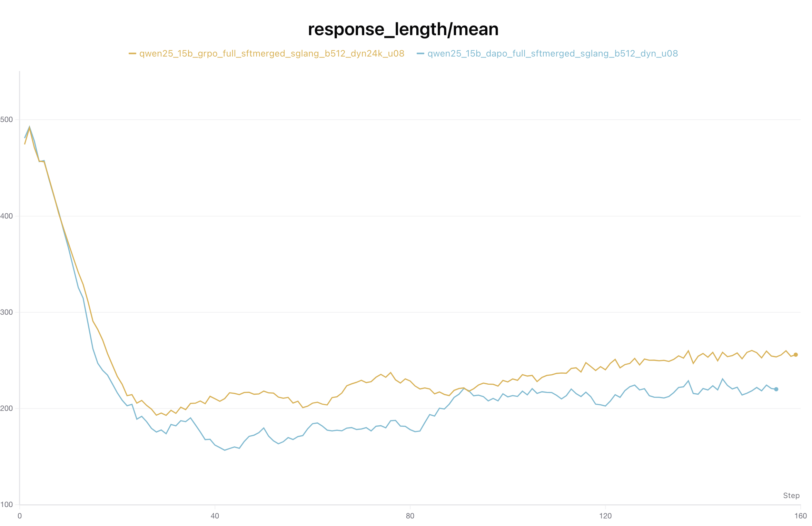
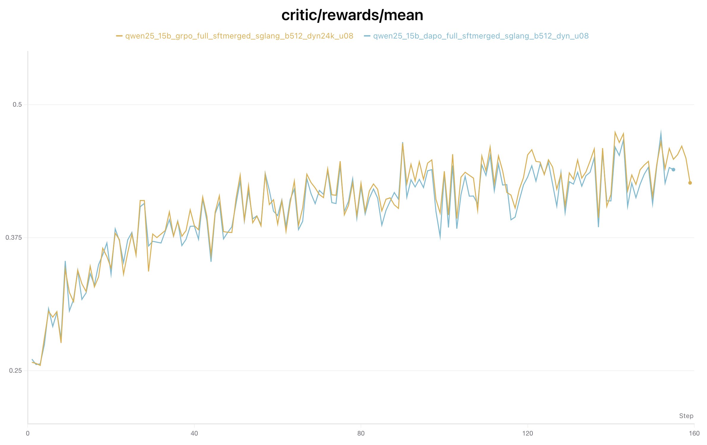
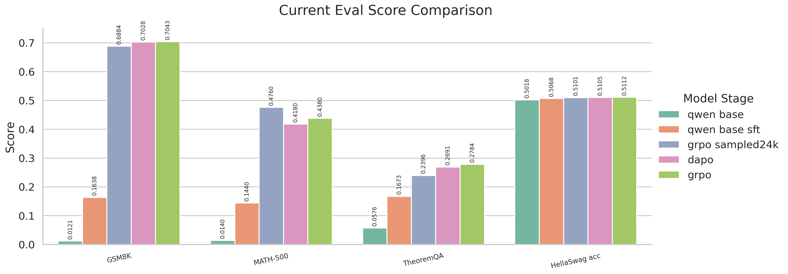

# 项目报告

## 这份文档记录什么

这份文档整理当前项目主线，内容包括数据准备、样本格式、基础模型、三阶段训练设计、奖励函数和评测集合。

详细评测分数另见 `EVAL_RESULT_TABLE_20260414.md`。

## 一、项目当前主线

当前项目围绕数学推理训练展开，主要做法是：

1. 先从原始数学数据中整理出一份小而干净的 `SFT` 集合。
2. 再整理出一份只要求题目和最终答案有效的大规模 `RL-ready` 集合。
3. 以 `Qwen/Qwen2.5-1.5B` 为基础模型，先做 `SFT`，再做 `GRPO`。
4. 用数学评测集观察数学能力变化，再用通用评测集观察常识与选择题能力是否保持正常。

## 二、数据处理与数据量

原始数据来自 `data/raw/deepmath_103k_raw.jsonl`。

### 1. `SFT` 数据

`SFT` 只保留有可用推理正文的样本，要求比 `RL` 更严格。

| 数据名 | 用途 | 训练集 | 验证集 | 说明 |
| --- | --- | ---: | ---: | --- |
| `strict_main` | `SFT` 主集合 | 1298 | 169 | 保留题目、推理正文、最终答案都完整的样本 |

### 2. `RL-ready` 数据

`RL-ready` 数据由 `data/build_rl_ready_dataset.py` 生成。这一步已经把要求从“必须有完整推理正文”改成了“题目有效、最终答案有效即可”。

| 数据名 | 用途 | 训练集 | 验证集 | 说明 |
| --- | --- | ---: | ---: | --- |
| `rl_strict` | `GRPO` 主集合 | 81463 | 10207 | 题目长度和答案长度限制较严格 |
| `rl_relaxed` | `GRPO` 宽松集合 | 81478 | 10208 | 题目和答案长度限制更宽 |
| `bigmath_verified_grpo` | 备选大集合 | 194274 | 24489 | 另一份更大的数学集合 |

### 3. 当前常用抽样集合

为了控制训练时间和显存占用，当前还保留了一份从 `rl_strict` 抽出的 `24k` 子集。

| 数据名 | 用途 | 训练集 | 验证集 | 说明 |
| --- | --- | ---: | ---: | --- |
| `sampled24k` | `GRPO` 试验集合 | 24000 | 10207 | 从 `rl_strict` 按难度分桶抽样 |

这份 `24k` 集合不是简单随机抽样，而是分两层来做：

1. 先按 `difficulty` 分成四档：
   `low <= 3.0`
   `mid <= 6.0`
   `high <= 8.0`
   `very_high > 8.0`
   如果样本没有 `difficulty`，也归到 `very_high`。
2. 再给四个难度桶分别分配固定配额，保证 `24k` 里不同难度都有覆盖。
3. 每个难度桶内部，再按 `task_type` 的原始占比分配抽样名额，而不是平均抽。
4. 如果某个题型在某个桶里样本不足，剩余名额会从同桶的其他剩余样本里补齐。
5. 验证集不做抽样，继续保留整份 `rl_strict_valid`，也就是 `10207` 条。

按当前脚本，四个难度桶的目标配额如下：

| 难度桶 | 规则 | 抽样数 |
| --- | --- | ---: |
| `low` | `difficulty <= 3.0` | 2400 |
| `mid` | `3.0 < difficulty <= 6.0` | 10800 |
| `high` | `6.0 < difficulty <= 8.0` | 7200 |
| `very_high` | `difficulty > 8.0` 或缺失 | 3600 |

这份抽样使用固定随机种子 `42`。最终得到的 `24k` 里，题型分布以 `algebra` 和 `calculus` 为主，也保留了 `geometry`、`number_theory`、`probability` 等类别。

## 三、样本格式处理

### 1. `SFT` 输入输出格式

`SFT` 的用户输入是统一的数学题提示词，核心要求有两条：

1. 保留简洁的分步推理。
2. 最后一行固定写成 `Final Answer: <answer>`。

在导出 `SFT` 数据时，已有解答会做一次清理，主要包括：

1. 去掉 `</think>` 这类内部标签。
2. 去掉重复的 `Final Answer` 标题和只重复答案的首行。
3. 去掉多余的 `\boxed{}` 包装，尽量保留推理正文。
4. 在最后补一行统一格式的 `Final Answer: <answer>`。

### 2. `RL` 输入输出格式

`GRPO` 使用另一套数学题提示词，要求和 `SFT` 接近，但对最终答案更严格：

1. 保留简洁推理。
2. 最后一行仍然使用 `Final Answer: <answer>`。
3. `<answer>` 位置只写最终答案本身，不附带额外解释。

### 3. 答案抽取与归一化

答案抽取当前同时兼容三种形式：

1. `Final Answer: ...`
2. `<answer>...</answer>`
3. `\boxed{...}`

此外还做了几项归一化处理：

1. 去掉数字中的逗号。
2. 统一 `√` 与 `\sqrt{}`。
3. 统一几种常见减号和除号写法。
4. 允许简单的等价表达式匹配。
5. 如果答案后面还有拖尾文本，会先截断到答案锚点附近。

## 四、基础模型与模型选择

当前主线基础模型是 `Qwen/Qwen2.5-1.5B`。

选择这版模型的原因很直接：现有实测里，这一版比更小的 `0.5B` 更稳定，后续 `SFT` 和 `RL` 的表现也更适合作为主模型继续推进。

当前常用模型形态有三种：

| 模型形态 | 名称 | 用途 |
| --- | --- | --- |
| `base` | `Qwen/Qwen2.5-1.5B` | 作为初始对照模型 |
| `sft` | `outputs/sft/strict_main_qwen25_15b_base_bs32_ga1` | 作为监督微调结果 |
| `sft merged` | `qwen base sft merged` | 作为后续全参 `GRPO / verl` 的基础模型 |

## 五、三阶段设计

当前训练设计分成三阶段。

### 第一阶段：基础模型对照

这一阶段使用 `Qwen/Qwen2.5-1.5B` 直接做评测，作用是提供起点分数。

这一阶段没有训练数据量，训练集和验证集都记为 `0`。

### 第二阶段：`SFT`

这一阶段使用 `strict_main`。

| 阶段 | 训练集 | 验证集 | 目的 |
| --- | ---: | ---: | --- |
| `SFT` | 1298 | 169 | 先让模型学会题目格式、推理组织方式和最终答案写法 |

### 第三阶段：`GRPO`

这一阶段使用大规模 `RL-ready` 数据，按当前项目里的几种常见用法，可以分成三类：

| 阶段 | 训练集 | 验证集 | 用途 |
| --- | ---: | ---: | --- |
| `GRPO strict full` | 81463 | 10207 | 当前主集合 |
| `GRPO sampled24k` | 24000 | 10207 | 当前高频试验集合 |
| `GRPO relaxed full` | 81478 | 10208 | 更宽松的对照集合 |

如果继续看第三阶段内部的检查点，`step20` 和 `final` 都属于这一阶段的中间结果，不是新的训练阶段。

## 六、奖励函数设计

当前 `GRPO` 奖励函数已经从单一正确性分，扩成了“正确性 + 格式质量 + 收尾质量 + 负向约束”的组合。

| 项目 | 分值 | 说明 |
| --- | ---: | --- |
| `exact match` | `+1.0` | 最终答案完全一致 |
| `equivalent match` | `+0.8` | 数学等价但文本不完全相同 |
| 格式奖励 | `+0.05` | 满足最终答案格式要求 |
| 干净收尾奖励 | `+0.03` | 提取到答案且答案后没有多余拖尾 |
| `<answer>` 标签项 | `0.0` | 当前保留接口，但不单独加分 |
| 无答案惩罚 | `-0.12` | 没有提取到最终答案 |
| 重复惩罚 | `-0.08` | 内容重复明显 |
| 角色串惩罚 | `-0.08` | 输出中混入 `user`、`assistant` 等角色串 |
| 拖尾惩罚 | 最多 `-0.20` | 答案后继续输出大量无关文本 |
| 超长惩罚 | 最多 `-0.05` | 超过长度预算后逐步扣分 |

长度预算当前按 `256 token` 计算，超过后开始扣分。

## 七、评测集合选择

当前评测分成数学评测和通用评测两组。

### 1. 数学评测

| 数据集 | 作用 |
| --- | --- |
| `MATH-500` | 看中高难度数学题的最终答案正确率 |
| `GSM8K` | 看基础数学题和文字题表现 |
| `TheoremQA` | 看更宽一些的数学与定理问答能力 |

### 2. 通用评测

| 数据集 | 作用 |
| --- | --- |
| `HellaSwag` | 看数学训练之后，通用选择题能力是否明显下降 |

### 3. 评测后端

当前正式评测更偏向使用 `hf` 后端，因为这套组合更稳定，便于重复执行。

`vllm` 仍然保留在一部分快测配置里，但在当前环境中，正式结果更适合先以 `hf` 为主。

## 八、训练过程观察

当前还保留了两张训练过程对比图，分别对应 `GRPO` 和 `DAPO` 的输出长度与平均奖励变化。

从 `response_length/mean` 这张图来看，两条曲线在前二十多步都先快速下降，说明模型先从偏长输出收回到更紧凑的回答长度。后面逐步回升时，`GRPO` 的平均输出长度整体略高，末段大约在 `250+`，`DAPO` 大约在 `220+`，说明 `GRPO` 这条线保留了更长一些的推理正文。

从 `critic/rewards/mean` 这张图来看，两条曲线都从大约 `0.25` 持续抬升到 `0.42 ~ 0.46` 区间，整体走势比较接近。后半段 `GRPO` 略高一些，但差距不大，说明两条训练线都在稳定学到奖励函数偏好的输出格式和答案质量。

## 九、当前项目状态

当前项目已经形成了比较明确的分工：

1. `SFT` 使用小而干净的推理样本。
2. `RL` 使用大规模、可验证的最终答案样本。
3. `Qwen/Qwen2.5-1.5B` 是当前更适合继续推进的基础模型。
4. 奖励函数已经覆盖正确性、格式和输出质量。
5. 评测集合同时覆盖数学能力和通用能力。

如果只看当前主线，可以把项目理解成：

先用 `strict_main` 把模型教会数学题回答格式，再用 `rl_strict` 或 `sampled24k` 继续做 `GRPO`，最后用 `MATH-500`、`GSM8K`、`TheoremQA` 和 `HellaSwag` 一起检查结果。

## 十、当前结果表

当前已经跑完并保留在仓库里的主结果如下：

| 模型阶段 | 训练数据量 | GSM8K | MATH-500 | TheoremQA | HellaSwag acc |
| --- | ---: | ---: | ---: | ---: | ---: |
| `qwen base` | 0 | 0.0121 | 0.0140 | 0.0576 | 0.5018 |
| `qwen base sft` | 1298 | 0.1638 | 0.1440 | 0.1673 | 0.5068 |
| `grpo sampled24k` | 24000 | 0.6884 | 0.4760 | 0.2396 | 0.5101 |
| `dapo` | 81463 | 0.7028 | 0.4180 | 0.2691 | 0.5105 |
| `grpo` | 81463 | 0.7043 | 0.4380 | 0.2784 | 0.5112 |

从这张表和图来看，原始 `qwen base` 在当前数学题格式上几乎没有可用表现。做完 `qwen base sft` 之后，数学评测已经能明显抬起来。再往后看，`grpo sampled24k`、`dapo` 和 `grpo` 这几组都继续提升了数学能力，其中 `grpo` 在 `GSM8K`、`TheoremQA` 和 `HellaSwag acc` 上更高，`grpo sampled24k` 在 `MATH-500` 上更高。
